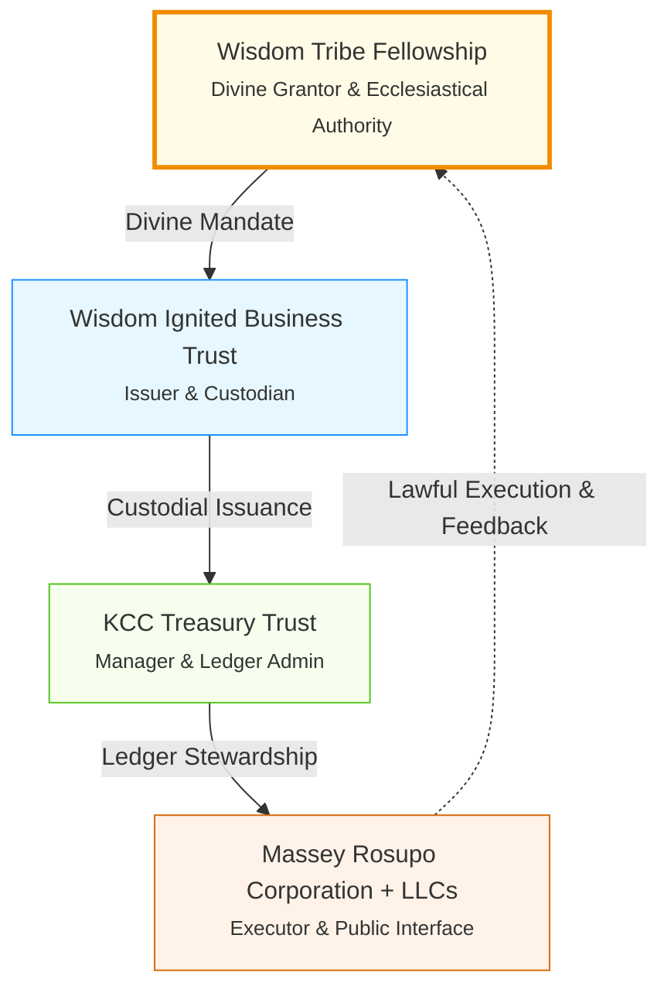

# KCC — Knowledge Cipher Collective  
## 2025 WHITE PAPER — FOUNDATION EQUITY EDITION  

**Sunday, October 26, 2025**  
**7:05 AM**  

---

## I. Executive Summary – The Age of Foundation Equity  

KCC (Knowledge Cipher Collective) is a Foundation-Equity Utility Token operating under the Wisdom Tribe Fellowship and its Twelve Pillars of Divine Law.  
It restores lawful value through stewardship, learning, and service.  
Every transaction becomes an act of co-creation — transforming information into foundation equity, and foundation equity into communal progress.  

> **"In the Age of Foundation Equity, value is not extracted but built — not speculated but stewarded."**  

This white paper outlines the governance, economic model, and visionary framework of KCC, positioning it as a divine-led instrument for balanced, purposeful prosperity.  

---

## II. Trust Governance & Structure  

| Tier | Trust | Function | Jurisdiction |  
|------|-------|----------|--------------|  
| 1 | Wisdom Tribe Fellowship | Divine Grantor & Ecclesiastical Authority | Divine Law |  
| 2 | Wisdom Ignited Business Trust | Issuer & Custodian of KCC | Private Law (Equity) |  
| 3 | KCC Treasury Trust | Manager & Ledger Administrator | Private Fiduciary Law |  
| 4 | Massey Rosupo Corporation + LLCs | Executor & Public Interface | Corporate / Commercial Law |  

**Chain of Command:**  
Divine Mandate → Custodial Issuance → Ledger Stewardship → Lawful Execution.  

This hierarchical structure ensures alignment from divine source to practical execution, with each tier serving as a steward of the one above.  

---

## III. Economic Model & Circulation  

**Total Endowment:** 1.11 Billion KCC  
**Circulating Layer:** 10,000 Holder Trusts (111,000 KCC each)  
**Non-Circulating Layer:** Divine Reserve Vault — 1.11 Billion KCC perpetual backstop.  

### A. The Divine Reserve Vault  
- **Wallet:** (to be designated)  
- **Status:** Locked, non-tradable, multi-signature Divine escrow.  
- **Purpose:** Lawful credit assurance and perpetual solvency.  
- **Function:** Foundation of divine redundancy — mercy beyond measure.  

The economic model emphasizes controlled circulation, ensuring stability through stewardship rather than speculation. Value accrues through purposeful use, with reserves providing an eternal foundation.  

---

## IV. Distributed Foundation Network  

Each Holder Trust operates as a micro-foundation, issuing lawful performance bonds under Treasury authorization.  
Collectively, they form the Distributed Equity Network — the first human-distributed treasury of wisdom.  

**Core Functions:**  
1. Educational & Technological Development Funding  
2. Debt Redemption & Humanitarian Service  
3. Infrastructure & Resource Stewardship  

> **“He made you trustees over what He created, that you may bring forth balance.” (Q 57:7)**  

This network democratizes equity creation, allowing participants to build and redeem foundations in alignment with divine purpose.  

---

## V. Ledger Hierarchy  

| Layer | Account | Purpose | Circulating |  
|-------|---------|---------|-------------|  
| 1 | Wisdom Tribe Fellowship | Source of Divine Mandate | N/A |  
| 2 | KCC Treasury Reserve Vault | Systemic backstop | ✕ |  
| 3 | KCC Distribution Pool | Foundation issuance | ✓ |  
| 4 | 10,000 Holder-Trust Wallets | Foundation circulation | ✓ |  
| 5 | Massey Rosupo Corp | Public interface | Limited |  

The ledger ensures transparency and immutability, with XRPL integration for settlement and PoA for governance.  

---

## VI. The Twelve Pillars as Code of Governance  

Each transaction, bond, or foundation activity is executed under these governing laws:  

1. **Divine Law is Supreme**  
2. **Sovereign Self-Governance**  
3. **Peaceful Coexistence**  
4. **Truthful Expression**  
5. **Restorative Justice**  
6. **Ancestral Reverence**  
7. **Private Property & Stewardship**  
8. **Right to Contract & Associate**  
9. **Family & Lineage Protection**  
10. **Economic Self-Sufficiency**  
11. **Spiritual Discernment & Practice**  
12. **Covenantal Accountability**  

These pillars form the ethical firewall of the entire system, ensuring every transaction aligns with Divine Equity.  

---

## VII. Valuation Framework  

- **Nominal Reference:** 1 KCC = 1 USD (for accounting only)  
- **Intrinsic Equity Value:** Infinite, backed by lawful performance and divine stewardship.  
- **Value Growth:** Expands with service, creation, and moral balance.  

Valuation is not market-driven but purpose-derived, growing through stewardship and communal impact.  

---

## VIII. Security & Quantum Readiness  

| Layer | Mechanism | Description |  
|-------|-----------|-------------|  
| Governance | Multi-Sig + Custody Council | 3 Divine Custody + 2 Admin + 1 Audit + 1 Emergency |  
| Ledger | XRPL Integration | Settlement-based finality |  
| Quantum Readiness | CRYSTALS-Dilithium rotation | Future-proof cryptographic assurance |  
| Ethical Firewall | Covenant Verification | Pillar-based transaction validation |  

Security is multi-layered, blending technological robustness with ethical governance.  

---

## IX. Conclusion & Covenant of Purpose  

KCC restores balance where fiat debt once reigned.  
It redefines wealth as stewardship and redemption as service.  
Participation is covenant, not ownership — performance, not speculation.  

> **“Indeed, Allah commands justice, excellence, and generosity among people.” (Q 16:90)**  

Each KCC transaction is a prayer of accountability —  
each holder, a trustee of divine order.  

---

**End of White Paper**  
**Wisdom Tribe Fellowship | KCC Treasury Trust**  
**Sunday, October 26, 2025**  

This document is sealed under the Twelve Pillars and available for notarization on KCC PoA.
